# Mapping the 2 Dimensional Problem to 1 Dimension

Since we aim to construct grid in $\Omega \subset \R^2$, we need a method to convert the 2D problem into a 1D problem. While we have the 1D equation

$\begin{align*}
-8 \sigma^4 M^2 x_s^2  x_{ss} - 4 \sigma^4 M M_x x_s^4  -  4  \sigma^2 m M x_{ss}  -  2 \sigma^2 m M_x x_s^2  = 0,
\end{align*}$

we need to reduce the dimension of $x \in \R^2$ and $M \in \R^{2 \times 2}$. 

## Mathematical Idea

Suppose we wish to solve the grid spacing along a discrete boundary $\Gamma$ given by the points $\gamma_i \in \R^2$ for $i=1,2,\dots, n$ where $n$ is the total number of points along the boundary. In-between each point is a linear interpolation $\Gamma_i$ for $i=1,2,\dots,n-1$ which defines the piecewise-continuous boundary. 

### Metric Tensor Field
To find the grid spacing according to the 2D metric tensor $M$, let's compute a new $m$ value to represent the desired metric stretching in $\R$ rather than $\R^2$. Let's define $m_i$ as

$m_i := (\gamma_{i+1} - \gamma_{i-1})^\top \cdot  \begin{pmatrix} M_{11} & M_{12} \\ M_{21} & M_{22} \end{pmatrix}_i \cdot (\gamma_{i+1} - \gamma_{i-1}), \quad i=2,\cdots, n - 1,$

and one sided differences for the edges

$m_1 := (\gamma_{2} - \gamma_{1})^\top  \cdot \begin{pmatrix} M_{11} & M_{12} \\ M_{21} & M_{22} \end{pmatrix}_1 \cdot (\gamma_{2} - \gamma_{1}),$

$m_n := (\gamma_{n} - \gamma_{n-1})^\top \cdot \begin{pmatrix} M_{11} & M_{12} \\ M_{21} & M_{22} \end{pmatrix}_n \cdot (\gamma_{n} - \gamma_{n-1}).$

Let's call this method "local." 

Another method would be to take $m_i$ as the nuclear norm (the sum of the singular values) of the 2D tensor corresponding with $x_i$. 

$m_i = \|M\|_\star = \text{trace}(\sqrt{M^* M })$.


### $x(s)$
Let's first solve the problem in $[0,L]$ where $L$ is the length of $\Gamma$.  

If we discretize $\hat{\Gamma} = [0,L]$ by $\hat{\gamma}_i \in \R$, let's preserve that $|\hat{\Gamma}_i| = |\Gamma_i|,$ or that the distances between points remain the same. Since we have linear interpolation, this equates to forcing the angle between $\Gamma_i$ to be flat. 

Let $\hat{x}_i \in \R$ by the solution in $\hat{\Gamma}$, then to get the solution distribution $x_i \in \R^2$ along $\Gamma$, we can place the point $x_i$ on the linear interpolation $\Gamma_j$ at the same distance between $x_{j-1}$ and $x_{j+1}$ as $\hat{x_i}$ is between $\hat{\gamma}_{j-1}$ and $\hat{\gamma}_{j+1}$. 


## Algorithm

We can compute the metric value $m_i$ using the following 

```julia
function GetMetricValues(points, getMetric; method = "local")
    #---------------------------
    # Description: Compute metric between points depending on method 
    # Input: 2xn array of points 
    # Output: 1xn array of metric 
    #---------------------------

    n = size(points, 2)
    m_vals = zeros(Float64, n)
    diff = zeros(Float64, 2, n)
    diff[:, 2:n-1] = points[:, 3:n] - points[:, 1:n-2]
    diff[:, n] = points[:, n] - points[:, n-1]
    diff[:,1] = points[:, 2] - points[:, 1]
    
    for i in 1:n
        # get metric value for the points M
        metricValues = getMetric(points[1, i], points[2, i])
        M = zeros(Float64, 2, 2)
        M[1, 1] = metricValues[1]
        M[2, 2] = metricValues[2]
        
        
        localDiff = diff[:, i]
        if method == "local"
            m_vals[i] = localDiff' * M * localDiff                        
        elseif method == "nuclear"
            m_vals[i] = M[1, 1] + M[2, 2]
        end
    end


    return m_vals
end
```

Comparison of results are shown in


## Results
We look at three cases

Let's compare the distribution of points for four different metrics
- Uniform.
- Clustering at $x=0.0$
- Clustering at $x=1$

### Metric Values

#### Uniform
##### Local
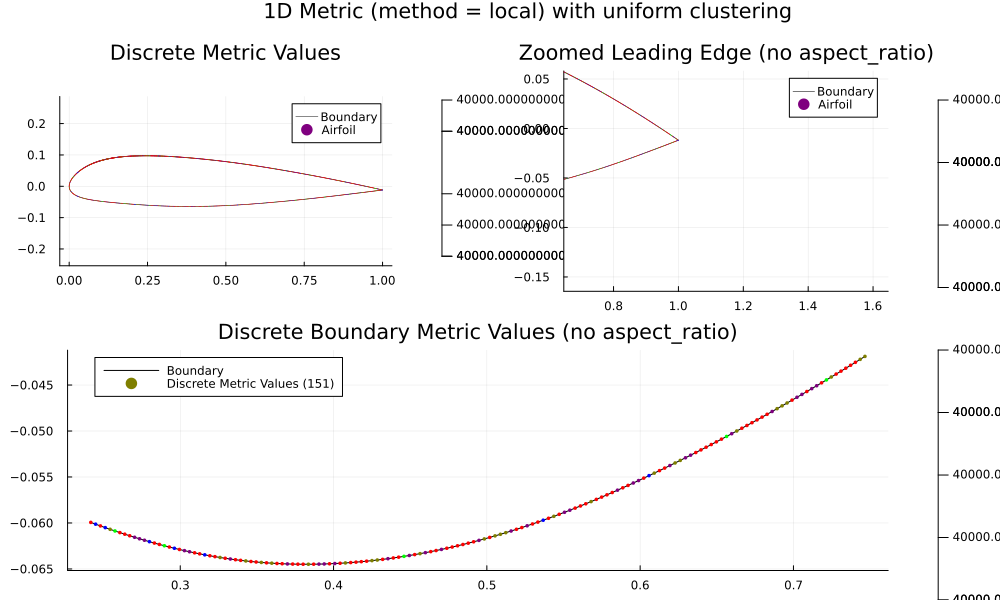
##### Nuclear
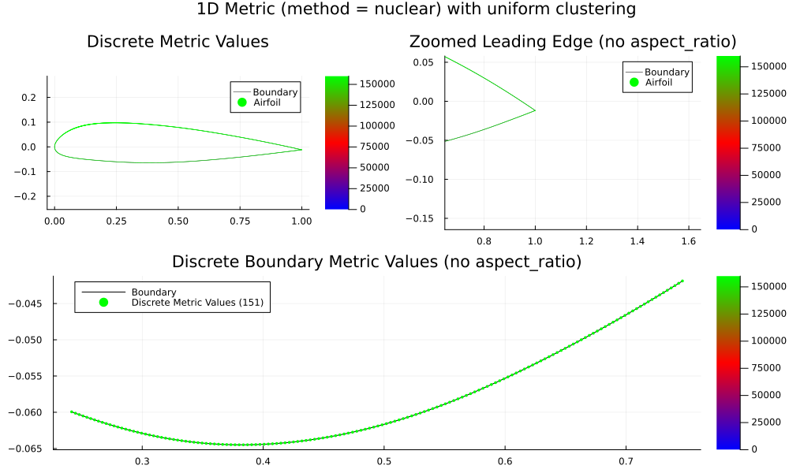

#### Clustering at $x=0$
##### Local
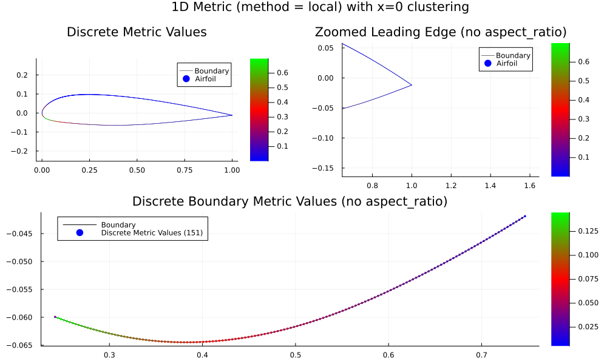
##### Nuclear


### Clustering at $x=1$
##### Local

##### Nuclear
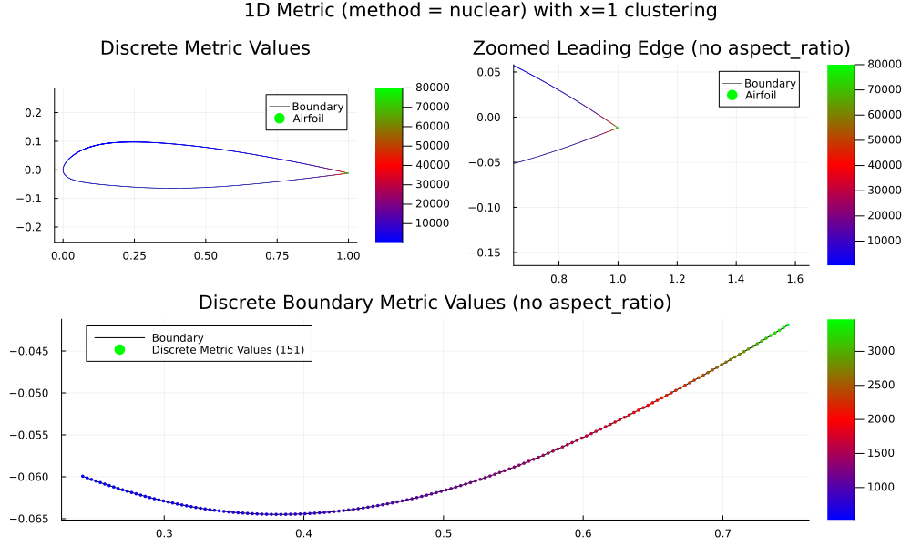

Local not shown due to optimal number of points being $\leq 2$.

### ODE Solution
#### Uniform
##### Local
<!-- 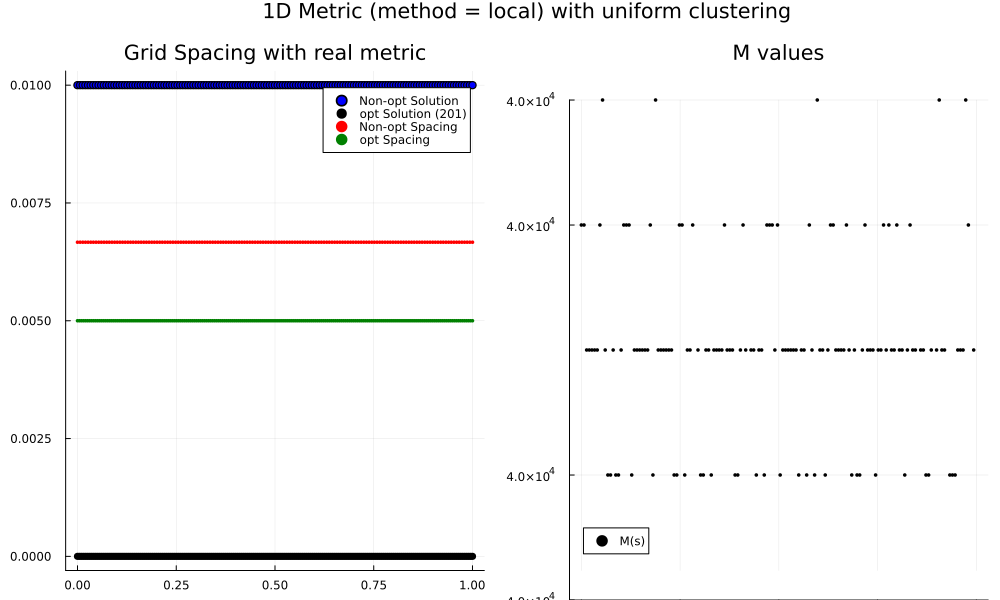 -->
##### Nuclear


#### Clustering at $x=0$
##### Local
<!-- 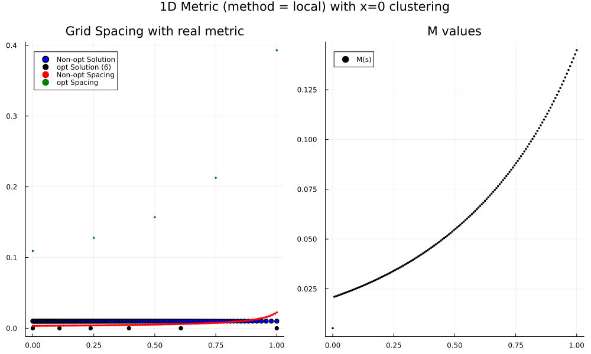 -->
##### Nuclear


#### Clustering at $x=1$
##### Local
<!-- 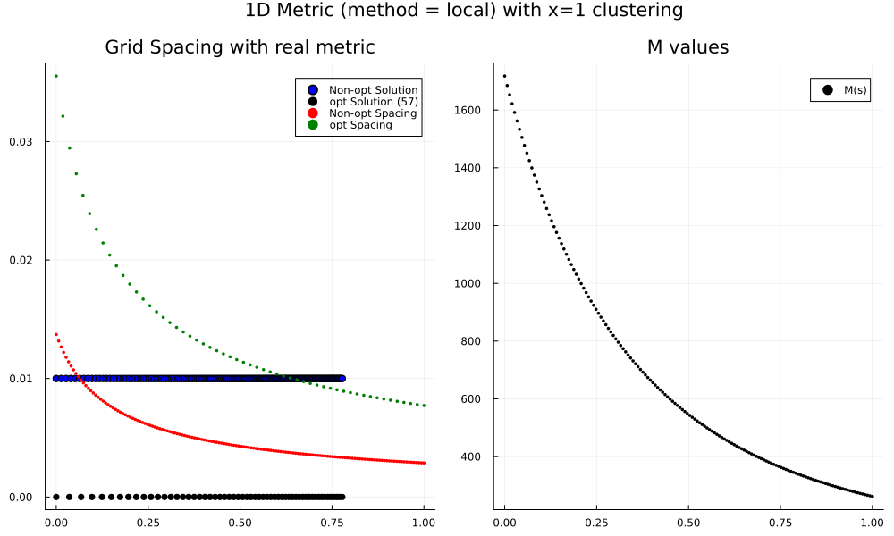 -->
##### Nuclear
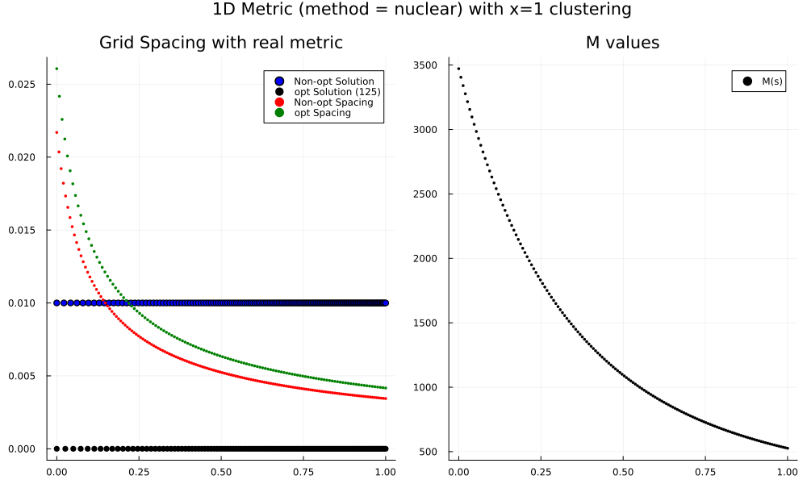

### Final Distribution
#### Uniform
##### Local
<!--  -->
##### Nuclear


#### Clustering at $x=0$
##### Local
<!-- 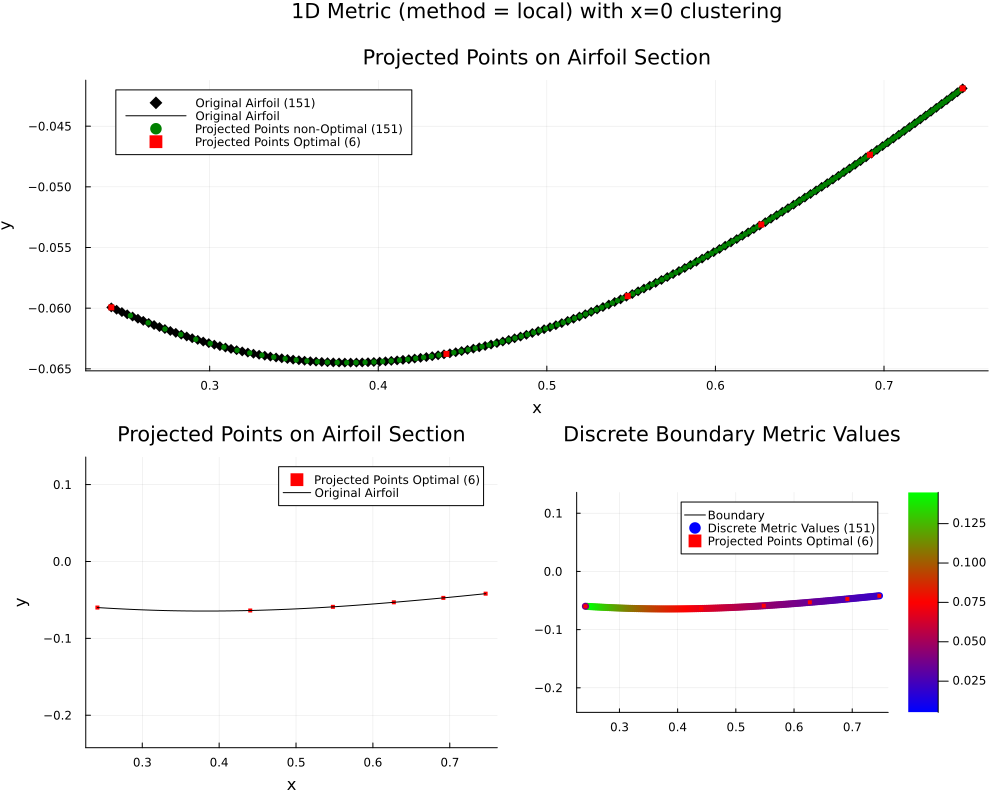 -->
##### Nuclear
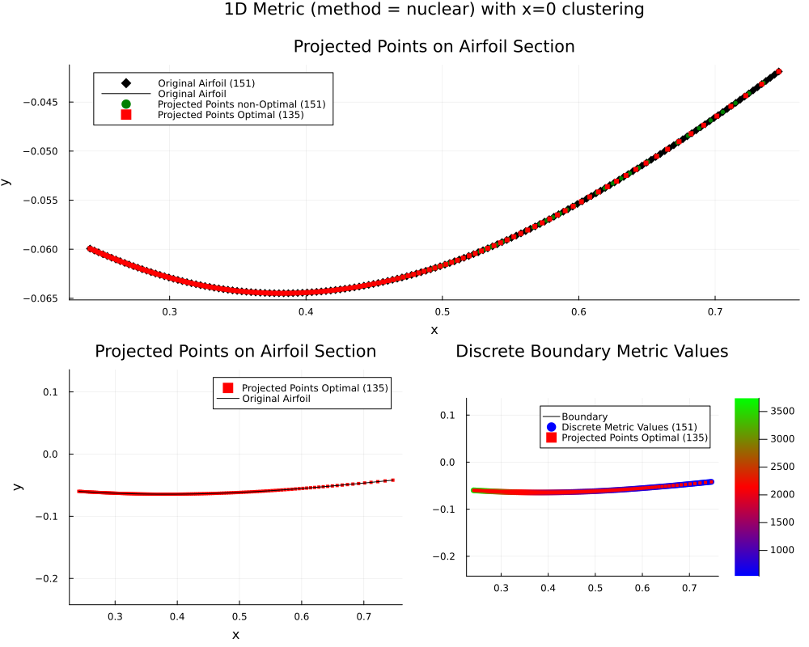

#### Clustering at $x=1$
##### Local
<!-- 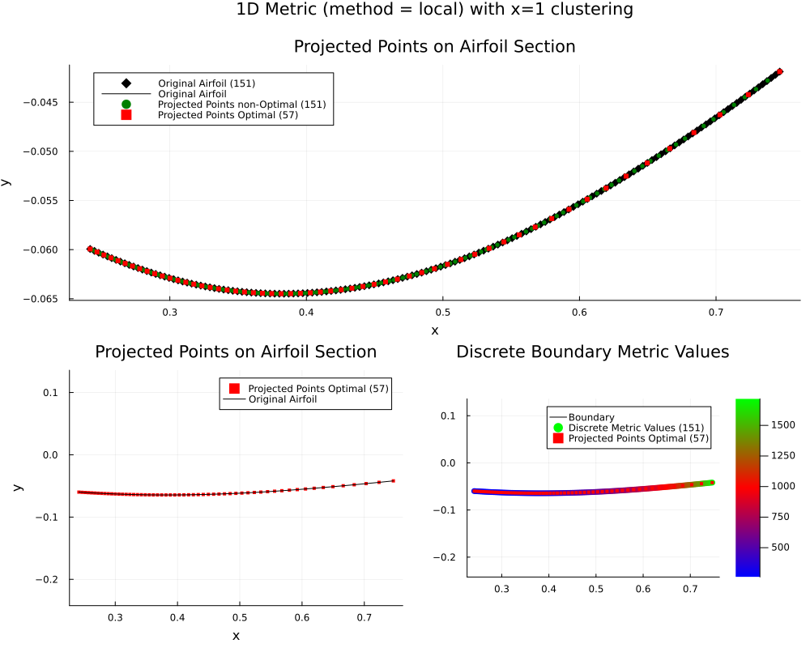 -->
##### Nuclear
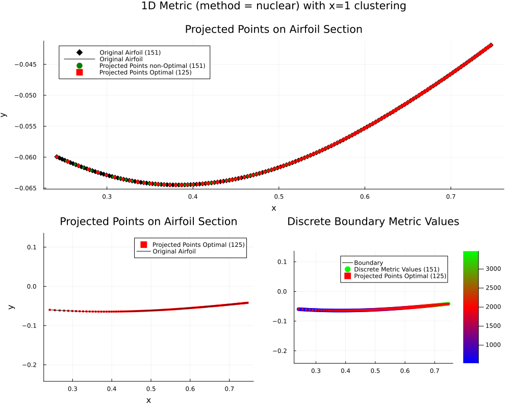