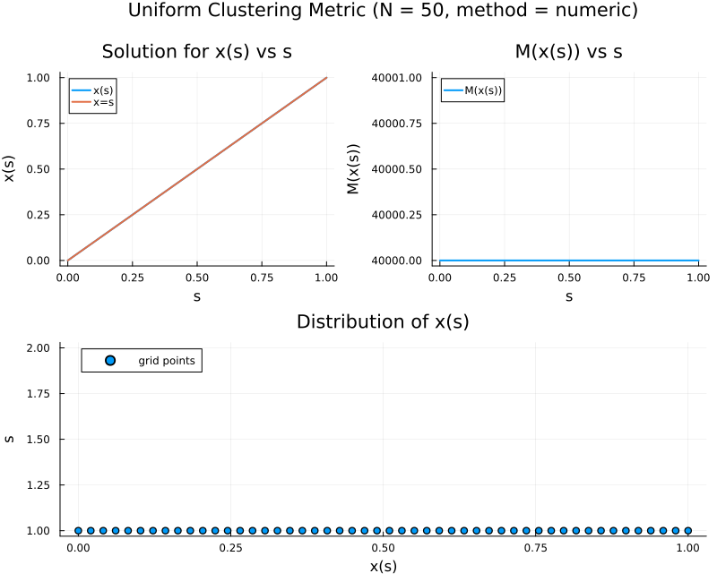
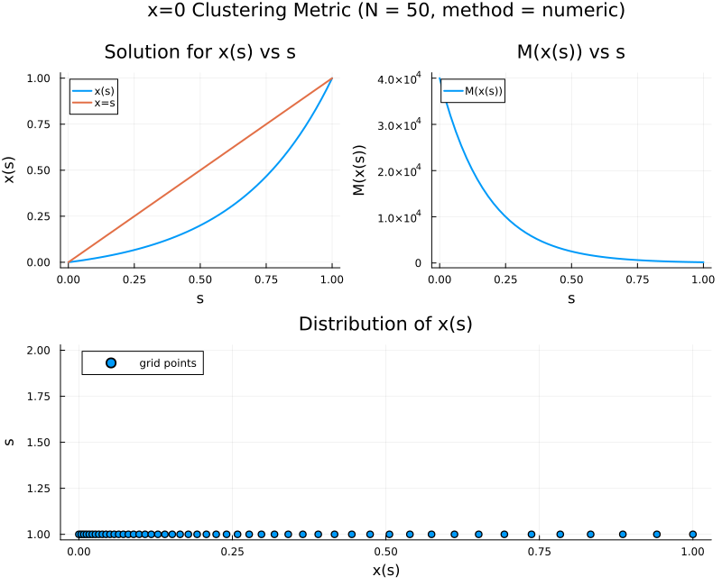
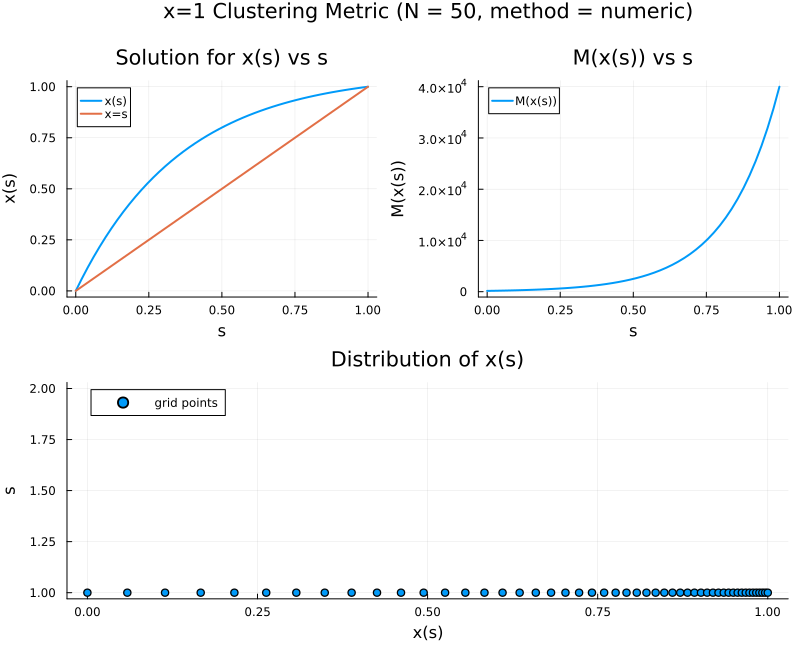
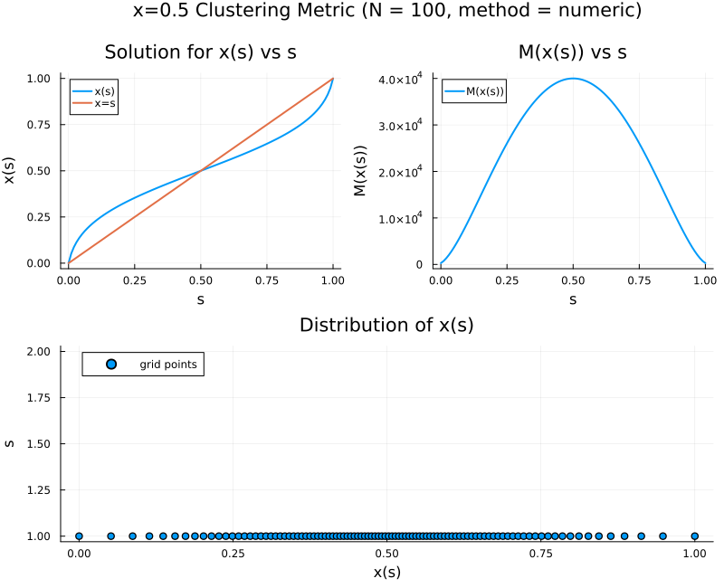

# Numerical Methods - First Order System
We wish to solve the ODE

$\boxed{8 \sigma^4  M^2 x_s^2 x_{ss}  + 4 \sigma^4  M M_x x_s^4 + 4\sigma^2 m^2 M x_{ss} + 2 \sigma^2 m M_x x_s^2  = 0.}$

We aim to solve the system of first order nonlinear boundary value odes. Let's use [DifferentialEquations.jl](https://docs.sciml.ai/DiffEqDocs/stable/) to try and solve the ODE with low effort.

## Formulation

Let $u_1 = x$ and $u_2 = x_s$ to find

$\begin{cases} 
u_1' = u_2 = x',\\
u'_2 = x'' = - \frac{1}{2} \frac{M_x}{M} x_s^2.
\end{cases}$

with dirichlet boundary conditions:

$u_1(1) = x_1, u_1(0) = x_0.$

Mathematical work shown [here](../ODE/MathematicalWork.md).


## Numerical Solver 
We can set up the problem like this

```julia
# Spacing ODE
function SpacingODE!(du, u, p, s)
    M_u1_func, M_func, sigma, _, _ = p
    u1, u2 = u

    M_u1 = M_u1_func(u1)
    M = M_func(u1)

    du[1] = u2
    du[2] = - (M_u1 * u2^2) / (2 * M)    
end


# Set the boundary conditions
function BoundaryConditions!(residual, u, p, s)
    _, _, _, x0, x1 = p
    residual[1] = u[1][1] - x0
    residual[2] = u[end][1] - x1
end
```
Now as the user we can define the metric function and derivative (analytically for now) and solve the spacing

```
using GridGeneration

# define metric and derivative
scale = 8000
M(x) = scale * (1 + 15 * (x))^(-2)
M_u1(x) = -2 * scale * (1 + 15 * (x))^(-3) * (15)

# boundary values
x0 = 0.0
x1 = 1.0

# define number of grid points
N = 100

# pass to the numerical solver
sol = GridGeneration.SolveODE(M, M_u1, N, x0, x1);
``` 


## Results
Let's compare the distribution of points for four different metrics
- Uniform: $M_1(x) = \alpha.$
- Clustering at $x=0.0$: $M_2(x) =  \frac{\alpha}{(1 + 15x)^2}.$
- Clustering at $x=1$: $M_3(x) =  \frac{\alpha}{(1 + 15(1-x))^2}.$
- Clustering at $x=0.5$: $M_4(x) = \alpha \text{exp}\left( \frac{-(x - 0.5)^2}{\eta}\right).$
- Clustering at the edges: $M_5(x) = M_2(x) + M_3(x).$ 

where $\alpha$ and $\beta$ are parameters.

Here are the results for the numerical approach with $\alpha = 40000$ and $\beta = 0.05$. With the last two examples, we are already running into the solver not being able to handel the stiffness of the problem.

### Uniform



### Clustering Near $x=0$



### Clustering Near $x=1$



### Clustering Near $x=0.5$




### Clustering Near Edges 


